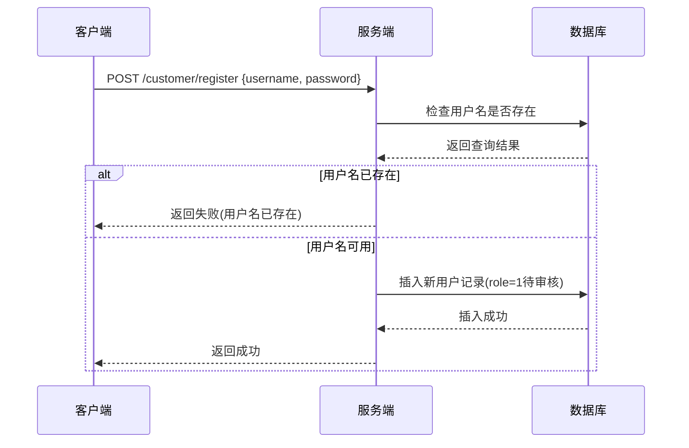
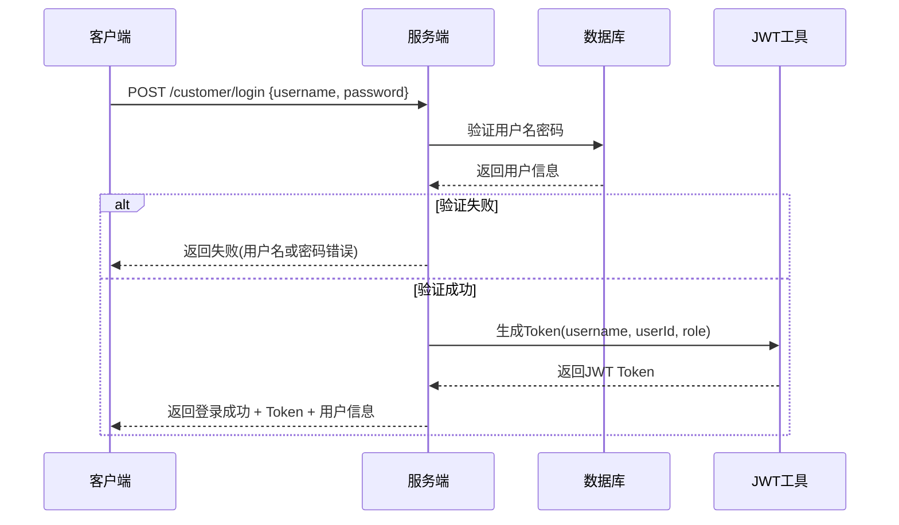

# TPC-H数据库管理系统 - 接口文档

## 系统概述

TPC-H数据库管理系统是一个基于Spring Boot的企业级数据库管理平台，提供TPC-H标准数据的管理、查询、分析和导出功能。系统采用JWT认证机制，支持多角色权限管理。

## 技术栈
- **后端**: Spring Boot 3.4.4 + MyBatis Plus 3.5.11 + MySQL
- **认证**: JWT Token
- **文档**: OpenAPI 3 (Swagger)
- **安全**: CORS配置 + JWT拦截器

---

## 📱 前端菜单设计建议

### 一级菜单结构
```
🏠 首页 (Dashboard)
👤 用户管理 (User Management)  
📊 数据管理 (Data Management)
🔍 数据查询 (Data Query)
📈 数据分析 (Data Analysis)
⚙️ 系统设置 (System Settings)
```

### 二级菜单详细设计

#### 👤 用户管理 (需要管理员权限)
- **用户列表** - 查看所有用户信息
- **用户审核** - 审核新注册用户
- **角色管理** - 管理用户角色权限

#### 📊 数据管理
- **TPC数据生成** - 使用dbgen生成TPC-H测试数据
- **数据导入导出** - 数据的导入导出操作
- **外键管理** - 数据库外键约束管理
- **数据路径管理** - TPC数据文件路径管理

#### 🔍 数据查询
- **客户信息查询** - 多条件客户信息检索
- **基础数据查询** - 各表基础数据查询
- **自定义查询** - SQL自定义查询界面

#### 📈 数据分析
- **TPC-H标准查询** - 标准TPC-H性能测试查询
- **执行计划分析** - SQL执行计划查看和分析
- **性能监控** - 查询性能统计和监控

#### ⚙️ 系统设置
- **数据库配置** - 数据库连接参数配置
- **系统参数** - 系统运行参数设置
- **日志管理** - 系统日志查看和管理

---

## 🔐 认证模块 (Authentication Module)

### 登录注册交互逻辑

#### 1. 用户注册流程


#### 2. 用户登录流程


### 接口列表

#### 用户注册
**接口地址**: `POST /customer/register`

**请求参数**:
```json
{
  "username": "testuser",
  "password": "123456"
}
```

**响应示例**:
```json
{
  "code": 200,
  "msg": "success",
  "data": null
}
```

#### 用户登录
**接口地址**: `POST /customer/login`

**请求参数**:
```json
{
  "username": "testuser", 
  "password": "123456"
}
```

**响应示例**:
```json
{
  "code": 200,
  "msg": "success",
  "data": {
    "token": "eyJhbGciOiJIUzI1NiJ9...",
    "username": "testuser",
    "userId": 1001,
    "role": 2,
    "expiresIn": 86400000
  }
}
```

#### 用户管理接口

| 接口 | 方法 | 说明 | 权限要求 |
|------|------|------|----------|
| `/customer/users` | GET | 获取用户列表 | 管理员 |
| `/customer/user-cnt` | GET | 获取用户总数 | 管理员 |
| `/customer/users` | POST | 创建新用户 | 管理员 |
| `/customer/users/{id}` | DELETE | 删除用户 | 管理员 |
| `/customer/users/{id}/approve` | PATCH | 审核用户 | 管理员 |

### 权限角色说明
- **role = 1**: 待审核用户
- **role = 2**: 普通用户
- **role = 3**: 管理员

---

## 📊 数据管理模块 (Data Management Module)

### TPC数据管理

#### 接口列表

| 接口 | 方法 | 说明 |
|------|------|------|
| `/tpc/generate` | POST | 生成TPC-H数据 |
| `/tpc/paths` | GET | 获取可用数据路径 |
| `/tpc/import` | POST | 导入TPC数据 |
| `/tpc/paths/{pathName}` | DELETE | 删除数据路径 |
| `/tpc/generation-status` | GET | 获取生成状态 |

#### 生成TPC数据
**接口地址**: `POST /tpc/generate`

**请求参数**:
```json
{
  "scaleFactor": 1,
  "pathName": "test_1gb",
  "description": "1GB测试数据"
}
```

#### 导入TPC数据
**接口地址**: `POST /tpc/import`

**请求参数**:
```json
{
  "pathName": "test_1gb",
  "truncateFirst": true,
  "batchSize": 1000
}
```

### 数据导出模块

#### 接口列表

| 接口 | 方法 | 说明 |
|------|------|------|
| `/api/export/data` | POST | 灵活数据导出 |
| `/api/export/tables` | GET | 获取可导出表列表 |
| `/api/export/table/{tableName}` | POST | 导出单个表 |

#### 数据导出示例
**接口地址**: `POST /api/export/data`

**请求参数**:
```json
{
  "folderName": "export_20241201",
  "tableNames": ["CUSTOMER", "ORDERS"],
  "includeHeader": true,
  "delimiter": "|"
}
```

### 外键管理模块

#### 接口列表

| 接口 | 方法 | 说明 |
|------|------|------|
| `/api/foreign-key/drop-all` | POST | 删除所有外键 |
| `/api/foreign-key/restore-all` | POST | 恢复所有外键 |
| `/api/foreign-key/status` | GET | 查询外键状态 |
| `/api/foreign-key/create-standard` | POST | 创建标准外键 |
| `/api/foreign-key/clear-saved` | POST | 清空已保存外键 |

---

## 🔍 数据查询模块 (Data Query Module)

### 客户信息查询

#### 接口列表

| 接口 | 方法 | 说明 |
|------|------|------|
| `/customer/query` | POST | 多条件客户查询 |
| `/customer/query/id/{id}` | GET | 按ID查询客户 |
| `/customer/query/name` | GET | 按姓名查询客户 |
| `/customer/query/nation/{nationkey}` | GET | 按国家查询客户 |
| `/customer/query/segment/{segment}` | GET | 按市场细分查询 |
| `/customer/query/balance` | GET | 按余额范围查询 |

#### 多条件查询示例
**接口地址**: `POST /customer/query`

**请求参数**:
```json
{
  "customerIds": [1, 2, 3],
  "customerName": "Customer#000001",
  "nationKeys": [1, 2],
  "marketSegments": ["BUILDING", "AUTOMOBILE"],
  "balanceMin": 1000.00,
  "balanceMax": 10000.00,
  "searchMode": "FUZZY",
  "page": 1,
  "size": 20,
  "sortBy": "C_ACCTBAL",
  "sortOrder": "DESC"
}
```

**响应示例**:
```json
{
  "code": 200,
  "msg": "success", 
  "data": {
    "customers": [...],
    "total": 150,
    "page": 1,
    "size": 20,
    "totalPages": 8,
    "executionTime": 45
  }
}
```

---

## 📈 数据分析模块 (Data Analysis Module)

### TPC-H标准查询

#### 接口列表

| 接口 | 方法 | 说明 |
|------|------|------|
| `/api/tpch/pricing-summary` | GET/POST | 定价汇总报表查询(Q1) |
| `/api/tpch/min-cost-supplier` | GET/POST | 最低成本供应商查询(Q2) |

#### 定价汇总报表查询 (TPC-H Q1)
**接口地址**: `GET /api/tpch/pricing-summary`

**查询参数**:
- `shipDate`: 截止发货日期 (默认: 2021-12-01)
- `intervalDays`: 间隔天数 (默认: 90)
- `includeExplain`: 是否包含执行计划 (默认: false)

**响应示例**:
```json
{
  "code": 200,
  "msg": "success",
  "data": {
    "results": [
      {
        "lReturnflag": "A",
        "lLinestatus": "F", 
        "sumQty": 37734107.00,
        "sumBasePrice": 56586554400.73,
        "avgQty": 25.52,
        "countOrder": 1478493
      }
    ],
    "executionTime": 2156,
    "resultCount": 4,
    "sql": "SELECT l_returnflag, l_linestatus...",
    "executionPlan": [...]
  }
}
```

#### 最低成本供应商查询 (TPC-H Q2)
**接口地址**: `GET /api/tpch/min-cost-supplier`

**查询参数**:
- `partSize`: 零件尺寸 (默认: 15)
- `partType`: 零件类型 (默认: BRASS)
- `regionName`: 地区名称 (默认: EUROPE)
- `limit`: 限制返回数量 (默认: 100)
- `includeExplain`: 是否包含执行计划 (默认: false)

---

## ⚙️ 系统设置模块 (System Settings Module)

### 数据库配置管理

#### 接口列表

| 接口 | 方法 | 说明 |
|------|------|------|
| `/customer/db-config` | GET | 获取数据库配置 |
| `/customer/db-config` | PUT | 更新数据库配置 |

#### 数据库配置示例
**接口地址**: `PUT /customer/db-config`

**请求参数**:
```json
{
  "host": "localhost",
  "port": 3306,
  "database": "tpch",
  "username": "root",
  "password": "password",
  "maxPoolSize": 20,
  "minPoolSize": 5
}
```

---

## 🛡️ 安全机制

### JWT Token认证
- **Token有效期**: 24小时 (86400000毫秒)
- **算法**: HS256
- **包含信息**: username, userId, role
- **使用方式**: Header中添加 `Authorization: Bearer <token>`

### CORS配置
- 允许所有域名访问
- 支持发送Cookie
- 允许所有请求方法和头信息

### 权限控制
- 基于role字段进行权限控制
- 管理员权限接口需要role >= 3
- 普通用户权限接口需要role >= 2

---

## 📋 错误码说明

| 错误码 | 说明 |
|--------|------|
| 200 | 请求成功 |
| 400 | 请求参数错误 |
| 401 | 未授权访问 |
| 403 | 权限不足 |
| 500 | 服务器内部错误 |

---

## 🚀 部署说明

### 环境要求
- Java 17+
- MySQL 8.0+
- Maven 3.6+

### 配置文件
- `application.yml`: 主配置文件
- JWT密钥配置
- 数据库连接配置
- 端口配置 (默认: 8001)

### 启动命令
```bash
mvn spring-boot:run
```

### Swagger文档地址
```
http://localhost:8001/swagger-ui.html
```

---

## 📞 技术支持

如有问题，请联系开发团队或查看相关文档：
- API文档: `/swagger-ui.html`
- 使用说明: 各模块使用文档
- 问题反馈: 通过系统日志或开发团队 